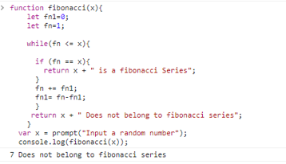

### Fibonacci Sequence 

 A fibonacci Sequence is denoted by fn, it is alist of numberswhere each number is the sum of the previous consecutive numbers 
The numbers are 0, 1,2,3,5, 8,13,21, 34,55, 89,144, 233,377
The Fibonacci repository has a javascript program that prompts the user to input any random number to check if it belongs to Fibnacci series. 

The program outputs either the number belongs to fibonacci or not 

